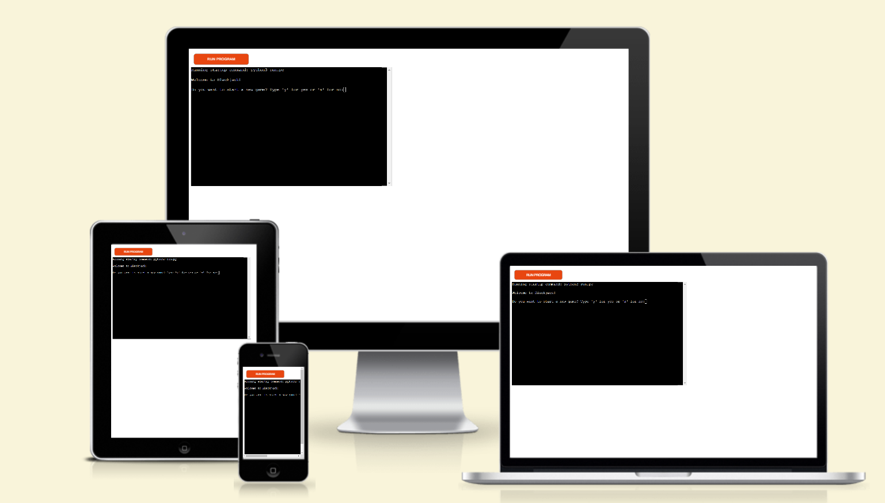

# Blackjack Game

This is a simple implementation of the popular card game Blackjack written in Python. The game allows the player to play against a computer dealer and try to beat their score without going over 21.

[Live version of my project](https://blackjack-p3.herokuapp.com/)

## How to Play

-The game starts by dealing two cards to the player and two cards to the dealer. The player's cards are visible, while only one of the dealer's cards is shown.
-The player's goal is to get a higher score than the dealer without exceeding 21. The value of numbered cards is their face value, face cards (J, Q, K) are worth 10, and Aces can be worth either 1 or 11, whichever is more advantageous.
-The player can choose to either "hit" (receive another card) or "pass" (end their turn) by entering 'y' or 'n' when prompted.
-If the player's score exceeds 21, they bust and lose the game. If the player chooses to pass, it becomes the dealer's turn.
-The dealer will keep hitting until their score is 17 or higher.
-After both the player and dealer have finished their turns, the scores are compared, and the winner is determined.