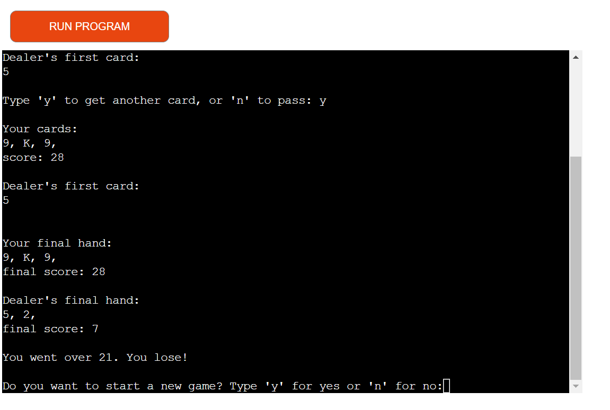

# Blackjack Game

This is a simple implementation of the popular card game Blackjack written in Python. The game allows the player to play against a computer dealer and try to beat their score without going over 21.

[Live version of my project](https://blackjack-p3.herokuapp.com/)

## How to Play

- The game starts by dealing two cards to the player and two cards to the dealer. The player's cards are visible, while only one of the dealer's cards is shown.
- The player's goal is to get a higher score than the dealer without exceeding 21. The value of numbered cards is their face value, face cards (J, Q, K) are worth 10, and Aces can be worth either 1 or 11, whichever is more advantageous.
- The player can choose to either "hit" (receive another card) or "pass" (end their turn) by entering 'y' or 'n' when prompted.
- If the player's score exceeds 21, they bust and lose the game. If the player chooses to pass, it becomes the dealer's turn.
- The dealer will keep hitting until their score is 17 or higher.
- After both the player and dealer have finished their turns, the scores are compared, and the winner is determined.

## Features

- The game uses a standard deck of 52 playing cards.
- The player can choose to hit or pass during their turn.
- The dealer follows a simple rule: they keep hitting until their score is 17 or higher.
- The game automatically shuffles the deck when less than 26 cards remain.
- The game includes error handling for invalid user input.
- The score is calculated based on the values assigned to each card.
- The game determines the winner based on a set of predefined rules.
- The player has the option to start a new game or exit after each round.

## Future Features

- Add more advanced gameplay features, such as splitting pairs and doubling down.
- Implement different difficulty levels or strategies for the dealer to provide a more challenging experience.
- and track the player's winnings or losses.
- Add multiplayer functionality to enable multiple players to compete against each other.

## Data Model

### Deck
The 'deck' variable represents the deck of cards in the game. It is initially defined as a list of cards, which includes numbers 2-10, and face cards (J, Q, K, A). The deck is used for dealing cards to players and dealers.

### Player and Dealer Hands
The 'player' and 'dealer' lists represent the hands of the player and the dealer, respectively. They are initially empty and cards are added to these lists during the game.

### Functions
- dealing(who): Deals a card to the specified player or dealer by randomly selecting a card from the deck and removing it from the deck.

- calculate_score(cards): Takes a list of cards and calculates the score based on the values of the cards. Numeric cards are worth their face value, face cards (J, Q, K) are worth 10, and Ace (A) can be worth either 1 or 11 depending on the current score.

- compare_score(player_score, dealer_score): Compares the scores of the player and dealer and returns the outcome of the game based on the scores.

- main(): The main game loop that controls the flow of the game. It deals two initial cards to the player and dealer, calculates their scores, displays the hands and scores, prompts the player for their actions, and determines the outcome of the game.

## Testing
I have manually tested this project by doing the following:
- Tested the code trough a PEP8 linter with no error
- Tested in my local terminal and the Heroku terminal
- Given invalid inputs
- My family and friends tested the game

### Validator Testing
- PEP8

### Start game 

### End game

### Get another card? /Yes

### Get another card? /No

### Result:Draw

### Result:Win

### Result:Loss

### Result:Win with Blackjack

### Result:Loss agaist Blackjack

### Wrong imput

### Bugs

#### Solved Bug
When i wrote the project it was showing draw result even when player score was above 21,fixed with more specific conditions

#### Remaining Bugs
No bugs remaining

## Deployment
This project was deployed using Code Institute's mock terminal for Heroku
- Steps for deployment:
    - Create a new Heroku app
    - Set the buildbacks to Python and NodeJS in that order
    - Link the Heroku app to the repository
    - Click on Deploy

## Credits 

- Code Institute for the deployment terminal, templates...
- Wikipediafor the details of the game
- [W3schools.com](https://www.w3schools.com/css/default.asp) 
- I use [Am I Responsive](https://ui.dev/amiresponsive) for responsive design picture
